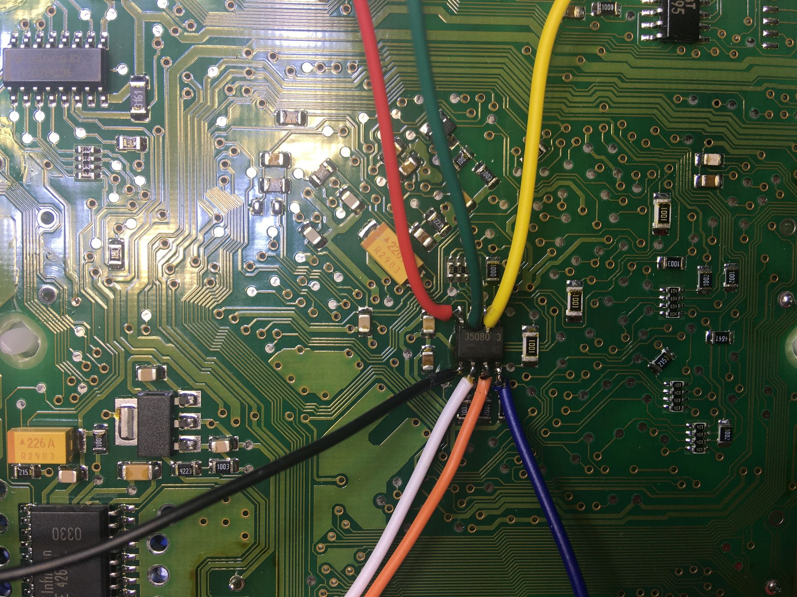
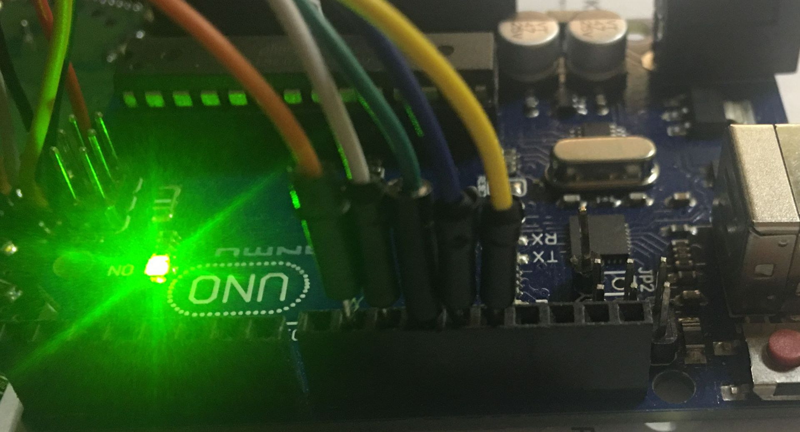
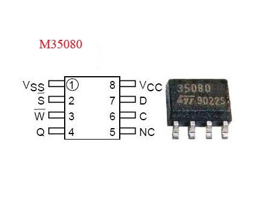

# m35080_odometer_fix
This default Skech now reads the full memory of EEPROM chips of the m35080 family like M35080, 08ODOWQ, M35080VP and 35080V6. </br> The read begins, after any kind of serial data is transmitted to the arduino (e.g just press the space bar and hit enter).

Secure Incremental Memory ranges from 0x00 till 0x1F</br>
Standard Memory ranges from 0x20 till 0x3FF

## Fully refactored version

I used this script to update VIN and mileage on IKE instrument cluster from junk yard. to retrofit it into my BMW E46.

<u>Mileage on new cluser MUST be lower then mileage on your car!!!</u>

Script will try to automatically find offset of VIN in EEPROM image. If this precedure fails, you'll need to modify code to disable *find_vin()* call, find VIN in EEPROM image and put offset to *vin_offs* variable.

Set NEW_VIN and NEW_MILEAGE_KM to required values

```
#define NEW_VIN       "KP83884"
#define NEW_MILAGE_KM xxxx // odometer value in KILOMETERS
```

For safety reasons I commented out write_odometer call. Uncomment it when you are absolutely sure!

```
//  write_odometer(NEW_MILAGE_KM);
```

I was able program m36080 chip in place, without removing it from PCB



As m35080 chip uses +5V input voltage. Generic Android UNO used to drive it's pins and power.



m35080 pinout



Connect pins according to table

| m35080 pin | Description       | Arduino UNO | Description |
| :--------: | :---------------- | :---------: | ----------- |
|     1      | Vss - ground      |     GND     |             |
|     2      | S - chip sel      |     10      | SS          |
|     3      | W - write protect |      9      | GPIO9       |
|     4      | Q - data out      |     12      | MISO        |
|     5      | not connected     |             |             |
|     6      | C - clk           |     13      | SCK         |
|     7      | D - data in       |     11      | MOSI        |
|     8      | Vcc - +5V         |     5V      |             |


## Arduino

I used an arduino micro, but any arduino which supports SPI is fine. Just switch the board in the arduino IDE.

## M35080 EEPROM
A datasheet is included in this repo. Connect Chipselect, Clock, In, Out, Vcc(5V) and Vss accordingly. Make sure, that max. current never exceeds 10mA.

## Write to Memory (0x20 till 0x3FF)
You can write to memory using the write_8() function. </br>
*Please backup your full memory before you make any changes.*

Example:

```
adr = 0x2F1;
char val = 0x20;
write_8(adr, val);
```

or also

```
int adr = 0x2F1;
intchar val = 0x00;
char content[] = {0x12};
for (int i = 0; i <= sizeof(content); i++) {
  write_8(adr, content[i]);
  adr = adr + 0x1;
}
```

## Write to secure (incremental) memory (0x00 till 0x1F)
You can write to memory using the write_secure() function.
Please keep in mind, that you can only count up these values, so be careful what you write.
*YOU CAN'T WRITE LOWER NUMBERS THAN WHAT IS ALREADY IN THERE*

Example:

```
int adr = 0x00;
char val1 = 0x12;
char val1 = 0x26;
write_secure(adr, val1, val2);
```

## Decoding BMW Cluster Information on E-Series Models

Secure memory info contains byte pairs. So every pair gets a hex index (which is NOT equal to the hex adress). </br>
If our example memory looks like this:

| 00  | 01 | 02 | 03 | 04 | 05 | 06 | 07 | Memory-Adress |
| :--:|:--:| :--:|:--:|:--:|:--:|:--:|:--:|:--:|
| 26 13 | 26 13 | 26 13 | 26 13 | 26 12 | 26 12 | 26 12 | 26 12 | 0x00 - 0x0F |

| 08  | 09 | A | B | C | D | E | F | Memory-Adress |
| :--:|:--:| :--:|:--:|:--:|:--:|:--:|:--:|:--:|
| 26 12 | 26 12 | 26 12 | 26 12 | 26 12 | 26 12 | 26 12 | 26 12 | 0x10 - 0x1F |

The Hex-Value for the milage (km) is 26 12 5 (bec. its the 5. column where the hex changes from 2613 to 2612) which equals 155.940 km in decimal.

The *VIN* is placed at *0x2E8- 0x2EF* where 0x2E8 - 0x2EE contain the last 7 digits of the vehicle VIN and 0x2EF probably contains the checksum (not sure about that). Since coding a new VIN from standard manufacturer tools is not possible, you may want to write the whole are blank (0xFF for 0x2E8- 0x2EF). After that, it's in factory state and the VIN can be set with manufacturer tools via OBD (but only once, so do this right after installing the cluster)

Example VIN:

| Memory-Adress| 0x2E8  | 0x2E9 | 0x2EA | 0x2EB | 0x2EC | 0x2ED | 0x2EE |
| :--:|:--:| :--:|:--:|:--:|:--:|:--:|:--:|:--:|
| Hex  | 4B | 54 | 31 | 37 | 37 | 32 | 37 | 35 |
| ASCII  | K | T | 1 | 7 | 7 | 2 | 7 | 5 |

So here the last 7 Digits of the Vin are KT17727. For fitting a used cluster you want the whole are to be 0xFF.
